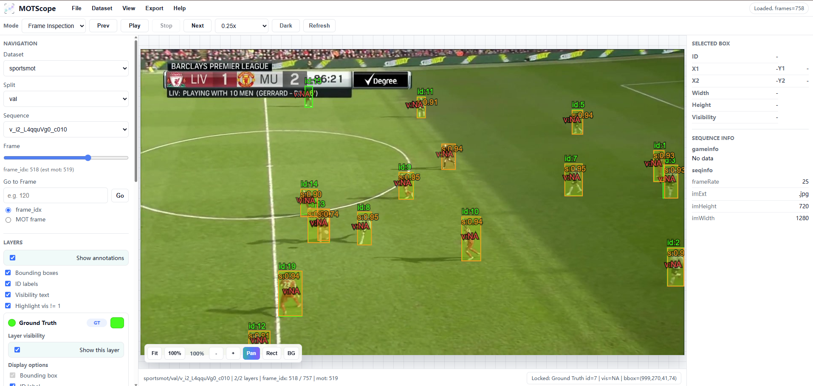

<p align="center">
  
</p>

# MOTScope

MOTScope is a lightweight browser-based visual inspection tool for multi-object tracking datasets, detections, ground truth annotations, and tracker outputs.



Repository: https://github.com/shijunjie07/MOTScope

## Overview

MOTScope helps inspect MOT-style datasets without writing one-off visualization scripts. It is designed for quick validation of dataset structure, annotation quality, detection quality, sequence metadata, and tracking outputs.

The app runs locally with Flask and keeps user dataset configuration under `instance/`, so datasets can be registered without editing source code.

## Features

- Browse image sequences frame by frame.
- Display bounding boxes, IDs, visibility text, and detection scores.
- Show ground truth and detections together with independent colors.
- Support multiple annotation layers with layer visibility controls.
- Switch datasets, splits, sequences, and annotation sources in the browser.
- Register custom datasets from the UI or local JSON configuration.
- Use smooth video playback through cached MP4 generation.
- Export annotated or raw frames, image ZIPs, and MP4 videos.
- Start export downloads automatically, with a `Download again` fallback link.
- Use a light theme by default, with a persistent dark theme option.
- Choose White Grid, Black Grid, Plain White, or Plain Black viewer backgrounds.
- Zoom in and zoom out below fit size, with pan/drag controls.
- Store local dataset configuration separately from source-controlled files.

## Supported Datasets

| Dataset | Description | URL |
| --- | --- | --- |
| SoccerNet-Tracking | Soccer broadcast video dataset for multi-object tracking. | https://github.com/SoccerNet/sn-tracking |
| DanceTrack | Multi-human tracking dataset with similar appearance and complex motion. | https://dancetrack.github.io/ |
| SportsMOT | Multi-sport tracking benchmark with sports video sequences. | https://github.com/MCG-NJU/SportsMOT |

Other MOT-style datasets can be added when their image folders and annotation files can be mapped to the expected structure.

## Supported Dataset Structure

Default MOT-style layout:

```text
<dataset-root>/
  <split>/
    <sequence>/
      img1/
        000001.jpg
        000002.jpg
        ...
      gt/
        gt.txt
      det/
        det.txt
      seqinfo.ini       # optional
      gameinfo.ini      # optional
```

Notes:

- `img1/` is the default image directory.
- `gt/` contains ground-truth annotation files.
- `det/` may contain detection files such as `det.txt`.
- `seqinfo.ini` and `gameinfo.ini` are optional.
- Custom layouts can be registered through the dataset configuration.

## Annotation Format

MOTScope expects MOTChallenge-style comma-separated annotation rows:

```text
frame,id,x,y,w,h,confidence,class,unused,visibility
```

Key fields used by the viewer:

| Field | Description |
| --- | --- |
| `frame` | MOT frame number |
| `id` | Object or track identity |
| `x, y, w, h` | Bounding box position and size |
| `confidence` | Detection score when available |
| `visibility` | Optional visibility value used for review/highlighting |

Malformed annotation lines are skipped and reported as warnings instead of crashing the viewer.

## Multi-Layer Annotations

Existing configs that only define `gt_files` still work. To show GT and detections together, add `annotation_layers` to a dataset entry:

```json
{
  "name": "sportsmot",
  "root": "/path/to/SportsMOT/dataset",
  "splits": ["train", "val", "test"],
  "image_dir": "img1",
  "gt_files": ["gt.txt"],
  "annotation_layers": [
    {
      "name": "Ground Truth",
      "type": "gt",
      "path": "gt/gt.txt",
      "color": "#00ff00",
      "visible": true,
      "draw_id": true,
      "draw_score": false
    },
    {
      "name": "Detections",
      "type": "det",
      "path": "det/det.txt",
      "color": "#ff9900",
      "visible": true,
      "draw_id": false,
      "draw_score": true,
      "score_threshold": 0.0
    }
  ]
}
```

Layer paths are relative to each sequence folder, such as `<dataset-root>/<split>/<sequence>/gt/gt.txt`. If `annotation_layers` is omitted, MOTScope derives a Ground Truth layer from `gt_files` and, when present, a Detections layer from `det/det.txt`.

Layer cards live in the left sidebar. Each card has a color swatch, layer name, type badge, master **Show this layer** switch, display options, and score threshold.

## Dataset Registration

By default, dataset definitions are stored in:

```text
instance/datasets.json
```

This file is local configuration and should not be committed.

To register a dataset from the UI, use **File -> Add Dataset...** and provide:

- dataset name
- dataset root path
- available splits
- optional folder and filename settings

To use a different config path, set the legacy environment variable:

```bash
export MOT_VIEWER_DATASETS_CONFIG=/path/to/datasets.json
```

## Smooth Playback

MOTScope has two playback modes:

- **Frame Inspection** keeps precise image-by-image navigation, hover, locked-box inspection, zoom, and pan.
- **Smooth Video** generates or reuses a cached MP4 under `instance/video_cache/`, plays it in a `<video>` element, and draws selected annotation layers on a synchronized canvas overlay.

Smooth playback requires `ffmpeg` on the system path. The video cache validates duration with `ffprobe`; stale or too-short cached files are regenerated.

## Export

Use **File -> Export...** to export:

| Export Target | Formats |
| --- | --- |
| Current Frame | `jpg`, `jpeg`, `png`, `svg` |
| Whole Sequence as Images ZIP | `jpg`, `jpeg`, `png`, `svg` |
| Whole Sequence as Video | `mp4` |

Exports can include no annotations, currently visible layers, or custom selected layers. Generated files are written under `instance/exports/`. The browser download starts automatically after completion, and a `Download again` link remains available.

## Canvas Background and Zoom

MOTScope supports different viewer canvas backgrounds, including White Grid, Black Grid, Plain White, and Plain Black. The default is White Grid. The canvas background is only used in the viewer workspace and does not modify the original image, video, or exported dataset files.

The canvas background can be changed from **View -> Canvas Background**, the left Display section, or the floating **BG** control. The selected background is saved in the browser and is independent from the app light/dark theme.

Viewer zoom supports 10% to 800%. The image or video can be zoomed out below fit size, making the grid workspace visible around the sequence frame. **Fit** returns to fit-to-screen, and **100%** shows original pixel scale when feasible.

## Keyboard Shortcuts

| Shortcut | Action |
|---|---|
| Ctrl + mouse wheel | Zoom in or out around the cursor |
| Ctrl + + | Zoom in |
| Ctrl + - | Zoom out |
| Ctrl + 0 | Fit or reset view |
| Shift + left drag | Pan the image or video |
| Space + left drag | Pan, if enabled |

## Installation

```bash
git clone https://github.com/shijunjie07/MOTScope.git
cd MOTScope
conda create -n motviewer python=3.11 -y
conda activate motviewer
pip install -r requirements.txt
```

For editable development:

```bash
pip install -e .
```

## Running the App

```bash
python app.py
```

Open:

```text
http://127.0.0.1:5000
```

If port 5000 is busy:

```bash
PORT=5055 python app.py
```

## Repository Structure

```text
app.py                         # local Flask entrypoint
mot_viewer/                    # Flask package and MOTScope services
  routes/                      # page and API routes
  datasets/                    # dataset config models and registry
  services/                    # viewer, annotation, video cache, export, jobs
templates/index.html           # app shell
static/app.js                  # frontend interaction logic
static/style.css               # UI and viewer styling
static/assets/                 # app logo and favicon assets
docs/assets/                   # README and documentation images
scripts/smoke_check.py         # smoke/regression checks
instance/                      # local config/cache/export output, not committed
```

## Roadmap

- Broaden dataset presets for more MOT benchmarks.
- Add richer tracker-result comparison workflows.
- Improve metadata and error reporting for large datasets.
- Add more annotation format importers, such as COCO-style tracking.
- Add optional browser-side review notes or issue markers.

## Contributing

Contributions are welcome.

1. Fork the repository.
2. Create a feature branch.
3. Make focused changes.
4. Run `python -m compileall .` and `python scripts/smoke_check.py`.
5. Commit with a clear message.
6. Open a pull request.

For major changes, please open an issue first to discuss the design.

## License

This project is licensed under the MIT License. See [LICENSE](LICENSE) for details.
